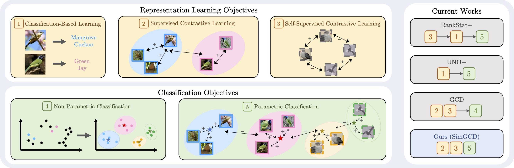

# GCD Imagenet-1K track SSB challenge at the OOD-CV workshop at ICCV 2023

This repo contains code from paper: [Parametric Classification for Generalized Category Discovery: A Baseline Study](https://arxiv.org/abs/2211.11727).



## Running

### Dependencies

```
pip install -r requirements.txt
```

Please also follow the instruction [here](https://github.com/sgvaze/SSB/tree/main) to set up the SSB API.

### Config

Set desired log directories in ```config.py```


### Scripts

***Train the model**:

```
bash scripts/run_${DATASET_NAME}.sh
```

***Data-augmentation**:

If you want to change the data-augmentation of the model such as ```RandmoErasing```, change that in ```data/augmentations/__init__.py```

If you want to change the data-augmentation of the model in each iter such as ```CutOut```, add that in ```train.py```

***Train different model**:

If you want to change the model of training, change the modle in ```train.py```
```
backbone = torch.hub.load('facebookresearch/dino:main', 'dino_vitb8')
or
backbone = torch.hub.load('facebookresearch/dino:main', 'dino_vitb16')
```
Notice: The above two models all fine-tuned the ```block.11``` layer.

## Citing this work

If you find this repo useful, please consider citing our paper:

```
@article{wen2022simgcd,
  title={Parametric Classification for Generalized Category Discovery: A Baseline Study},
  author={Wen, Xin and Zhao, Bingchen and Qi, Xiaojuan},
  journal={arXiv preprint arXiv:2211.11727},
  year={2022}
}
```

## Acknowledgements

The codebase is largely built on this repo: https://github.com/sgvaze/generalized-category-discovery.

## License

Licensed under the MIT License - see the [LICENSE](LICENSE) file for details.
